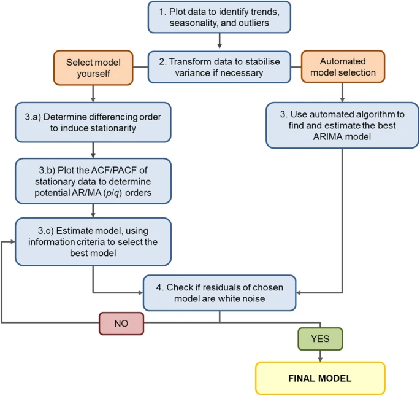

# Interrupted ARIMA

## Background
ITS: evaluate the impact of large-scale health intervention

Methods: 
* segment regression(trends, types of impact)
* ARIMA(seasonality, autocorrelation)

ARIMA modelling is useful when other approaches are not suitable.

observational studies relyingb on a small number of measurememnts pre- and post-intervention are prone to bias as they do not account for pre-existing underlying short- and long-term trends.

ITS is considered one of the best designs for establishing causality when RCT are feasible.

## Methods
topics:
* select the shape of the impact
* the model selection process
* transfer functions
* checking model fit
* interpretation of findings

### time series properties

#### non-stationarity
ARIMA requirement: ts *stationary*
WHAT? constant mean; constant variance; constant covariance depending only on time interval.
sources of non-stationarity
* changing variance : apply a log transformation
* increasing or decreasing trend: take difference $Y_t - Y_{t+1}$

#### Autocorrelation
ACF: correlation between each observation and previous values at various lags.
PACF: correlation between an observation and past values that is not explained by correlations at lower other lags.

#### Seasonality
seasonality is usually dealt with by taking the **seasonal difference**.

**Note** : when taking the seasonal difference for monthly data, the first 12 observations are lost, since the seasonal difference cannot be calculated for those observations. In general, more time points are needed.

### Components of ARIMA models
assumptions: errors are normally distributed.

Available Situation:
* any continuous outcome
* large count that are not bounded by zero
Unavailable Situation: small counrts following Poisson distribution

ARIMA notation: $(p,d,q)$
* $p$ the order of the AR part of the model
* $d$ the degree of non-seasonal differencing
* $q$ the order of the MA part of the model

seasonal ARIMA: $(p,d,q)\times (P,D,Q)_S$
* $D$ the degree of seasonal differencing
* $P$, $Q$ AR, MA terms for seasonal component

### Evaluating interventions using ARIMA
three main types of intervention effect
* step change
* pulse
* ramp
The potential shape of the intervention impact should be hypothesised a prior.

If there are multiple potential models,  use AIC BIC to select the most appropriate combination of impact variables.

Lag: 
* prespecify a reasonable period of time in which it would be expected for the impact to be observed based on content knowledge or previous research to avoid spurious associations.
* The most appropriate delay within this range of options can be determined at the modelling stage.

**Notice**: Unlike segmented regression, including time or seasonal dummy variables in ARIMA model is not necessary, as ARIMA eliminate trends and seasonality through differencing. 
**defect**: However, then pre- and post- intervention trends cannot estimated from the model. 
**Solution**: include time as covariate and use ARMA models(for autocorrelation) to estimate the intervention trend.

### Fitting an ARIMA model

